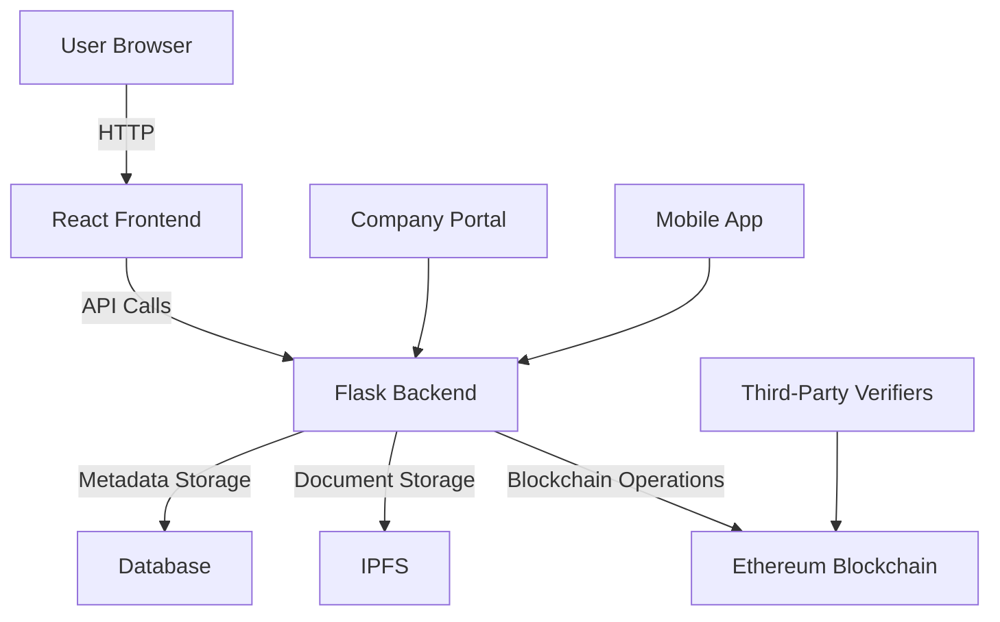
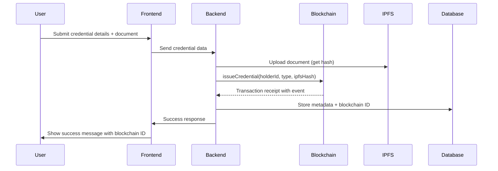
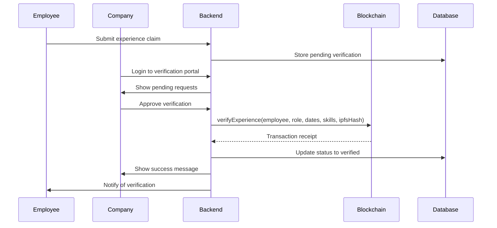

# TrueCred - Blockchain Verification System Documentation

## Table of Contents
1. [Introduction](#introduction)
2. [System Architecture](#system-architecture)
3. [Blockchain Implementation](#blockchain-implementation)
4. [Verification Workflow](#verification-workflow)
5. [API Documentation](#api-documentation)
6. [Setup Guide](#setup-guide)
7. [Testing](#testing)
8. [Future Enhancements](#future-enhancements)

## Introduction <a name="introduction"></a>
TrueCred is a unified platform that leverages blockchain technology to verify and showcase skills, experience, and credentials. This system provides:

- **Immutable verification** of credentials using Ethereum blockchain
- **Tamper-proof records** of professional experiences
- **Cryptographic proof** for all verified credentials
- **Decentralized storage** of supporting documents using IPFS
- **LinkedIn-style verification badges** for user profiles

## System Architecture <a name="system-architecture"></a>


### Components
1. **Frontend**: React-based user interface
2. **Backend**: Flask API server
3. **Blockchain**: Ethereum network (local/testnet/mainnet)
4. **Storage**: 
   - IPFS for documents
   - PostgreSQL/SQLite for metadata
5. **Smart Contracts**: Core verification logic

## Blockchain Implementation <a name="blockchain-implementation"></a>
### Technology Stack
- **Blockchain Network**: Ethereum (Ganache for development, Goerli for testing)
- **Smart Contracts**: Solidity (v0.8.0)
- **Web3 Library**: Web3.py (Python), ethers.js (JavaScript)
- **Development Tools**: 
  - Truffle Suite (Contract compilation)
  - Hardhat (Alternative to Truffle)
  - Remix IDE (Contract testing)

### Key Features
1. **Credential Verification**:
   - Permanent record on blockchain
   - Cryptographic proof of authenticity
   - Revocation capability for issuers

2. **Experience Verification**:
   - Company-authorized verification
   - Tamper-proof work history
   - Skill certification

3. **Document Storage**:
   - IPFS for decentralized storage
   - Content-addressed hashes stored on-chain
   - Immutable document references


## Verification Workflow <a name="verification-workflow"></a>
### Credential Issuance Process


### Experience Verification Process


## API Documentation <a name="api-documentation"></a>
### Base URL: `https://api.truecred.app`

### 1. Credential Endpoints
| Endpoint | Method | Description | Parameters |
|----------|--------|-------------|------------|
| `/credentials` | POST | Issue new credential | `holder_id`, `type`, `ipfs_hash` |
| `/credentials/{id}` | GET | Get credential details | `id` |
| `/credentials/{id}/verify` | GET | Verify credential status | `id` |
| `/credentials/{id}/revoke` | POST | Revoke credential | `id` |

### 2. Experience Endpoints
| Endpoint | Method | Description | Parameters |
|----------|--------|-------------|------------|
| `/experiences` | POST | Submit experience claim | `user_address`, `organization`, `role`, `start_date`, `end_date`, `skills`, `ipfs_hash` |
| `/experiences/pending` | GET | Get pending verifications | - |
| `/experiences/{id}/verify` | POST | Verify experience | `id` |
| `/users/{address}/experiences` | GET | Get user experiences | `address` |

### Sample Request
```bash
curl -X POST https://api.truecred.app/credentials \
  -H "Content-Type: application/json" \
  -d '{
    "holder_id": "student-123",
    "type": "Diploma",
    "ipfs_hash": "QmXoypizjW3WknFiJnKLwHCnL72vedxjQkDDP1mXWo6uco"
  }'
```


## Setup Guide <a name="setup-guide"></a>
### Prerequisites
- Node.js v16+
- Python 3.9+
- Ganache CLI
- MetaMask Wallet
- IPFS Desktop

### Backend Setup
```bash
# Clone repository
git clone https://github.com/yourusername/truecred.git
cd truecred/backend

# Create virtual environment
python -m venv venv
source venv/bin/activate  # Linux/MacOS
venv\Scripts\activate    # Windows

# Install dependencies
pip install -r requirements.txt

# Set environment variables
cp .env.example .env
# Edit .env with your configuration

# Run blockchain node
ganache-cli -p 8545

# Deploy contracts
python deploy_contracts.py

# Start backend server
python app.py
```

### Frontend Setup
```bash
cd ../frontend

# Install dependencies
npm install

# Configure environment
cp .env.example .env.local
# Edit .env.local with your API URL

# Start development server
npm start
```

## Testing <a name="testing"></a>
### Test Cases
1. **Credential Issuance**
   - Input: Valid credential data
   - Expected: Blockchain transaction success, DB record created
2. **Credential Verification**
   - Input: Valid blockchain ID
   - Expected: Returns "verified: true"
3. **Credential Revocation**
   - Input: Valid blockchain ID
   - Expected: Verification returns "verified: false"
4. **Experience Verification**
   - Input: Valid experience data from authorized company
   - Expected: Verification badge appears on user profile
5. **Unauthorized Access**
   - Input: Invalid credentials for privileged operations
   - Expected: Proper error responses

### Test Command
```bash
# Backend tests
cd backend
pytest

# Smart contract tests
cd ../blockchain
truffle test
```

## Future Enhancements <a name="future-enhancements"></a>
1. **Multi-Chain Support**:
   - Polygon for low-cost transactions
   - Binance Smart Chain for alternative ecosystem
   
2. **Zero-Knowledge Proofs**:
   - Private credential verification
   - Selective disclosure of information
   
3. **Decentralized Identity**:
   - DID (Decentralized Identifiers) integration
   - Verifiable Credentials (VC) standard
   
4. **Mobile Wallet**:
   - Credential storage in mobile wallet
   - QR code-based verification
   
5. **Tokenization**:
   - Reward tokens for verifiers
   - Governance tokens for platform management

6. **AI-Powered Verification**:
   - Automated document verification
   - Fraud detection algorithms

---

**TrueCred Team**  
Kirti Singh | Shubham Gupta | Saniya Singh  
*Final Year Project*  
*Information Technology Department*  
*University of Mumbai*
